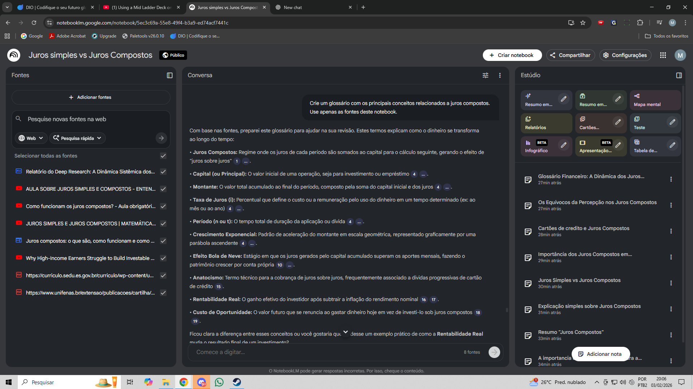
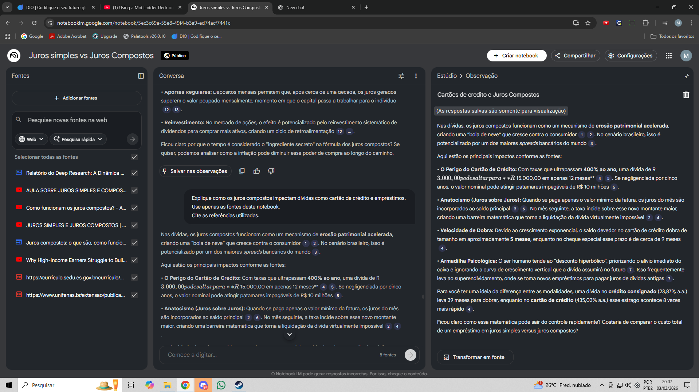
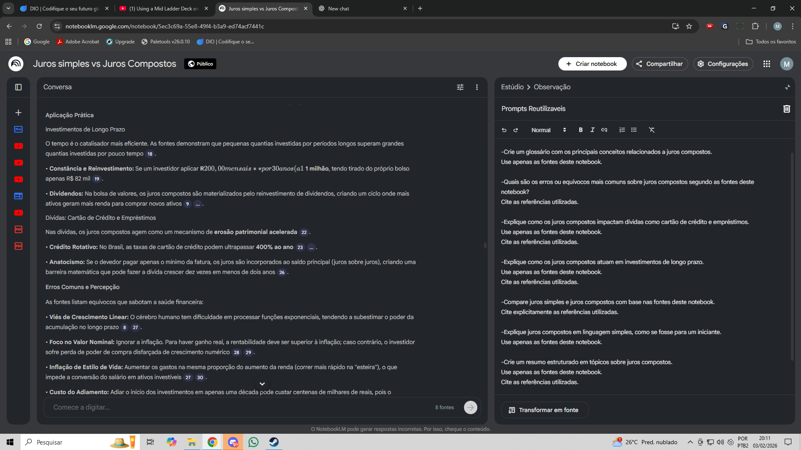

# notebooklm-juros-compostos
# Miniguia de Juros Compostos com NotebookLM

Este repositório documenta o projeto que desenvolvi a partir
do meu caderno temático criado no **NotebookLM**.

📌 **NotebookLM usado:**  
https://notebooklm.google.com/notebook/5ec3c69a-55e8-49f4-b3a9-ed74acf7441c

---

## 📌 Objetivo
Desenvolver um caderno temático reunindo fontes institucionais
sobre juros compostos, definir objetivos de estudo, elaborar
perguntas estratégicas e testar variações de prompts para gerar
resumos estruturados, glossário, e prompts reutilizáveis.

---

## 📂 Conteúdo deste repositório

### 📘 Miniguia
#1 - Visão Geral:

• Juros compostos consistem no efeito de "juros sobre juros", onde os rendimentos são incorporados ao capital para o cálculo seguinte, gerando crescimento exponencial. Funcionam como uma "bola de neve" que acelera a riqueza em investimentos ou a ruína em dívidas de cartão de crédito e financiamentos. O tempo é o fator mais decisivo nesse processo, superando até o valor dos aportes iniciais.
  
#2 - Resumo Estruturado:
DEFINIÇÃO:

• Os juros compostos consistem na aplicação de juros sobre o capital inicial somado aos rendimentos acumulados de períodos anteriores, processo conhecido como "juros sobre juros",. Diferente do regime simples, esse modelo gera um crescimento exponencial onde o valor dos juros aumenta a cada período.
  
APLICAÇÕES PRÁTICAS:

• Investimentos: São o motor de acumulação em CDBs, Tesouro Direto, contas digitais e no reinvestimento de dividendos de ações.
• Dívidas: Regem o custo de financiamentos, empréstimos pessoais e o crédito rotativo do cartão de crédito,.
• Aportes Regulares: Permitem que, após certo tempo, o rendimento mensal supere o valor economizado pelo investidor.

EXEMPLOS:

• Efeito do Tempo: Um investidor que aplica R$500 mensais por30 anos acumula R$985.000, enquanto quem começa apenas 10 anos mais tarde acumula apenas R$ 338.000 sob as mesmas taxas.
• Bola de Neve Negativa: Uma dívida de R3.000,00 no cartão de credito pode saltar para R$15.000,00 em apenas um ano devido a taxas anuais que superam 400%.
• Acumulação: Investir R$200,00 por mes durante 30 anos(com taxa de 182 mil em um patrimônio superior a R$ 1 milhão.
Ficou clara a diferença de impacto entre começar a investir cedo ou tarde? Se desejar, podemos calcular quanto um valor específico renderia para você em 10 ou 20 anos.

### 🧠 Prompts
-Crie um glossário com os principais conceitos relacionados a juros compostos.
Use apenas as fontes deste notebook.
-Quais são os erros ou equívocos mais comuns sobre juros compostos segundo as fontes deste notebook?
Cite as referências utilizadas.
-Explique como os juros compostos impactam dívidas como cartão de crédito e empréstimos.
Use apenas as fontes deste notebook.
Cite as referências utilizadas.
-Explique como os juros compostos atuam em investimentos de longo prazo.
Use apenas as fontes deste notebook.
Cite as referências utilizadas.
-Compare juros simples e juros compostos com base nas fontes deste notebook.
Cite explicitamente as referências utilizadas.
-Explique juros compostos em linguagem simples, como se fosse para um iniciante.
Use apenas as fontes deste notebook.
-Crie um resumo estruturado em tópicos sobre juros compostos.
Use apenas as fontes deste notebook.
Cite as referências utilizadas.
-Explique por que o conceito de juros compostos é importante para a educação financeira.
Use apenas as fontes deste notebook e cite as referências.

#3 - Glossário:

• Juros: É a remuneração ou o "aluguel" pago pelo uso de um capital inicial (principal) durante um determinado tempo.
• Montante: Representa o valor total acumulado ao final de uma operação financeira, sendo o resultado da soma do capital inicial com os juros.
• Taxa: É o percentual que indica o custo ou rendimento do dinheiro em uma unidade de tempo (como ao mês ou ao ano), devendo ser convertida para forma decimal ou fracionária nos cálculos.

#4 - Conclusão:

Os juros compostos são uma força exponencial definida pela incidência de juros sobre juros, onde o rendimento de cada período é integrado à base de cálculo seguinte. Diferente do regime simples, que cresce de forma linear, o montante composto acelera ao longo do tempo, criando o chamado "efeito bola de neve". Nessa dinâmica, o tempo é o catalisador mais eficiente, superando até o valor dos aportes iniciais na construção de riqueza,. Entretanto, essa força também atua como um vetor de insolvência em dívidas de alto custo, como o cartão de crédito, onde o saldo devedor pode dobrar em poucos meses. Dominar esse conceito é essencial para evitar armadilhas psicológicas como a inflação do estilo de vida e garantir que o capital trabalhe para você, e não o contrário.

### 📚 Fontes
Fontes de video:
- https://www.youtube.com/watch?v=SpyWH9U15Ek&pp=ygUhSnVyb3Mgc2ltcGxlcyB2cy4ganVyb3MgY29tcG9zdG9z
- https://www.youtube.com/watch?v=G6LJcuKY80c&pp=ygUhSnVyb3Mgc2ltcGxlcyB2cy4ganVyb3MgY29tcG9zdG9z
- https://www.youtube.com/watch?v=Uth75BB0ASU&pp=ygUhSnVyb3Mgc2ltcGxlcyB2cy4ganVyb3MgY29tcG9zdG9z
- https://www.youtube.com/watch?v=KWlkJEahXB0&pp=ugMGCgJwdBABugUEEgJwdMoFIUp1cm9zIHNpbXBsZXMgdnMuIGp1cm9zIGNvbXBvc3Rvc9gHAQ%3D%3D

Fontes de texto:
- https://www.unifenas.br/extensao/publicacoes/cartilha/matematicafinanceira.pdf
- https://curriculo.sedu.es.gov.br/curriculo/wp-content/uploads/2025/05/1a-Serie_MAT_RPE_QUINZENA-10_LIVRETO.pdf
- https://www.sunoresearch.com.br/artigos/juros-compostos/
- https://www.suno.com.br/artigos/c/financas-pessoais/

### 🖼️ Screenshots

### Visão geral do notebook

### Exemplo de Notas

### Nota de prompts reutilizáveis

---

## 🛠️ Ferramentas
- **NotebookLM (Google)**
- **GitHub**
- Processamento de texto / Markdown

---
